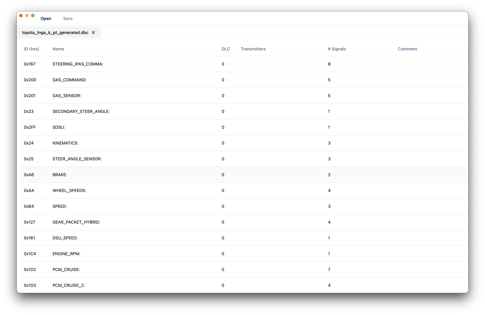
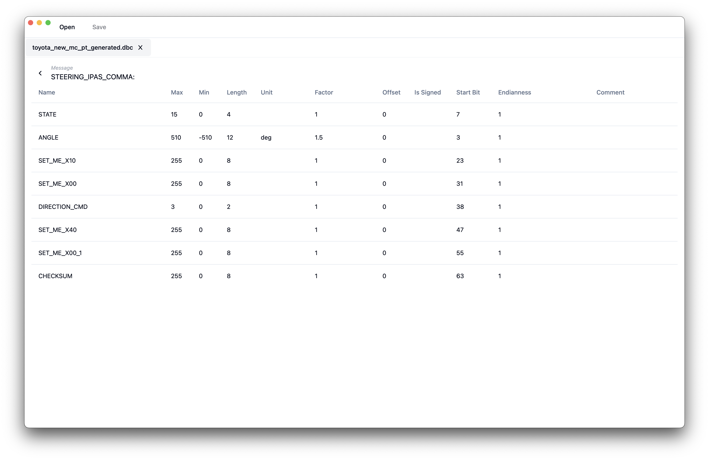

# README

## About

Created by Kade Angell

Built with `Wails v2.5.1` and [shadcn's CLI](https://ui.shadcn.com/docs/cli)

### Demo Images



## Starting up
Instructions for getting started with Go, Wails, and Node

### MacOS
Install [go](https://go.dev)
If you have [homebrew](https://brew.sh) installed, you can install go like this
```powershell
brew install go
```

Install the wails CLI 
```console
go install github.com/wailsapp/wails/v2/cmd/wails@latest
```

Install [Node](https://nodejs.org/en)

Note: if you have a preferred JS runtime, feel free to use it here. I'll be providing instructions for using node for simplicity
```console
brew install nodejs
```

### Windows
Install [go](https://go.dev)
If you have [chocolatey](https://chocolatey.org) installed, you can install go like this
```powershell
choco install golang
```

Install the wails CLI 
```console
go install github.com/wailsapp/wails/v2/cmd/wails@latest
```

Install [Node](https://nodejs.org/en)

Note: if you have a preferred JS runtime, feel free to use it here. I'll be providing instructions for using node for simplicity
```console
choco install nodejs
```

### Getting dev env set up
```console
cd frontend
npm install
```

### Installing Components
To install components, use shadcn's CLI tool to install

More info here: https://ui.shadcn.com/docs/cli#add

Example:
```console
npx shadcn-ui@latest add [component]
```

## Live Development

To run in live development mode, run `wails dev` in the project directory. The frontend dev server will run on `http://localhost:34115`. Connect to this in your
browser and connect to your application.

This lets you use web dev tools to debug your frontend. You can also view your application in the wails dev application that will start automatically

## Building

To build a redistributable, production mode package, use `wails build`.

## License
MIT
